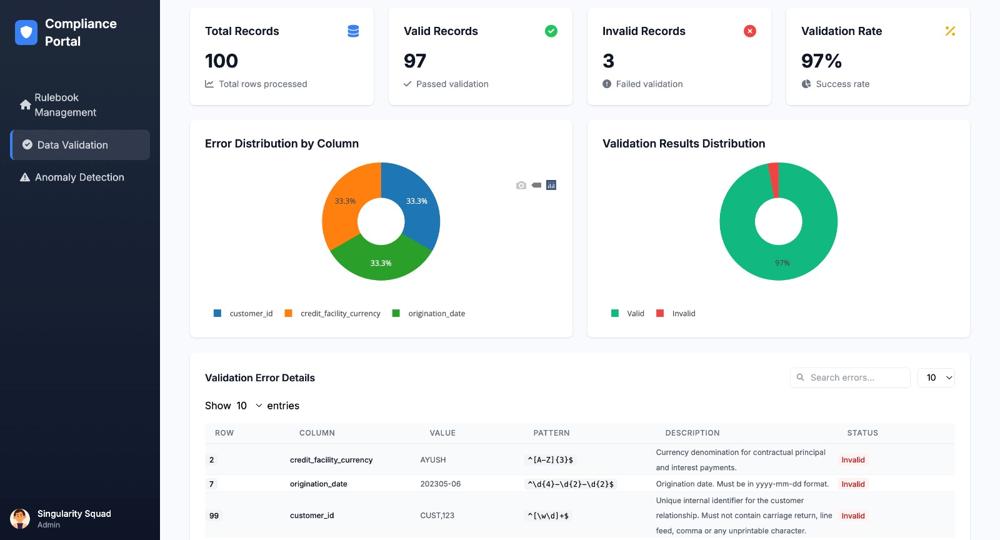

# RuleSense: Gen AI-powered Data Profiling for Regulatory Reporting

## Table of Contents

- [Introduction](#introduction)
- [Demo](#demo)
- [Inspiration](#inspiration)
- [What It Does](#what-it-does)
- [How We Built It](#how-we-built-it)
- [Challenges We Faced](#challenges-we-faced)
- [How to Run](#how-to-run)
- [Tech Stack](#tech-stack)
- [Team](#team)
- [Sample Dataset](#sample-dataset)
- [Regulatory Rules](#regulatory-rules)
- [Submission Deliverables](#submission-deliverables)

---

## Introduction

RuleSense is a Gen AI-powered compliance assistant designed to automate regulatory data profiling in the financial sector. It uses Gemini’s document processing capabilities and unsupervised machine learning models to extract rules from complex regulatory documents, validate transactional data, identify anomalies, assess risks, and recommend remediation actions.

---

## Demo

- Live Demo: [Link to Demo](https://drive.google.com/file/d/14ohjSF69MOwovV-6GUIg_t_cBEYsRBm2/view?usp=sharing)
- Video Walkthrough: [Link to Video](#)

Screenshots:

- RuleSense 
  

- GenAI Rulebook Generator
  

- Regex Based Rulebooks
  
  
- Transactions Data Validator
  
  
- Anomaly Patterns Detector in Transactions  
  

- Anomaly Detector  
  

---

## Inspiration

Financial institutions face a major challenge when translating regulatory reporting instructions into enforceable data rules. This manual and error-prone process often slows down compliance cycles. RuleSense was built to streamline this process by automatically interpreting regulations and applying intelligent validations.

---

## What It Does

- Extracts data validation rules from regulatory PDFs using Gemini AI
- Parses extracted rules into structured JSON format with regex
- Validates uploaded transactional CSVs against these rules
- Flags validation issues and suggests remediation actions
- Detects anomalies in data using unsupervised learning
- Implements a dynamic risk scoring system
- Enables audit-friendly, explainable insights for compliance teams


---

## How We Built It

**Regulatory Rulebook Extraction**

- PDF parsing using Gemini AI’s document processing API
- Semantic chunking and cosine similarity for relevant rule matching
- Regex-based pattern extraction and rulebook generation (JSON format)

**Validation Engine**

- CSV upload interface for transactional datasets
- Field-by-field regex validation using the generated rulebook
- Detailed output: matched rule ID, violation description, suggestion

**Anomaly Detection**

- Uses Isolation Forest, DBSCAN, and LOF from scikit-learn
- Scales numeric features with StandardScaler
- Visualizes anomaly distribution using matplotlib

**Frontend**

- Built using flask templates to allow document and CSV uploads, validation display, and anomaly review


---

## Challenges We Faced

- Parsing varied PDF structures and noisy formatting
- Extracting accurate regex patterns from natural language rules
- Balancing anomaly detection thresholds to avoid false positives
- Ensuring explanations are understandable by non-technical auditors
- Maintaining performance and scalability for large CSVs

---

## How to Run

#### Clone the repository
```bash
git clone [https://github.com/your-username/rulesense.git](https://github.com/ewfx/gaidp-singularity-squad.git)
cd gaidp-singularity-squad.git
```

#### Set up environment variables
```bash
cp code/src/backend/.env.example code/src/backend/.env
```

#### Edit .env and update with your Gemini API key:
```bash
GOOGLE_API_KEY=your_api_key_here
FLASK_ENV=development
FLASK_DEBUG=1
```

### Install Docker
 - Follow official instructions to install Docker and Docker Compose:
 - macOS/Linux: https://docs.docker.com/desktop/install/mac-install/
 - Windows: https://docs.docker.com/desktop/install/windows-install/


### Verify installation:

```bash
docker --version
docker compose version
```


### Build and run the application
##### macOS/Linux
```bash
docker compose up --build
```
##### Windows

```bash
docker-compose up --build
```

### Open the application
##### Once the container is running, go to:
```bash
http://localhost:5001
```

### API Docs
##### For API Testing, go to:
```bash
http://localhost:5001/docs
```


## Tech Stack

**Languages & Frameworks**
- Python 3.11
- Flask (Web framework)
- Jinja2 (HTML Templating)
- Scikit-learn (Machine Learning)
- Pandas, NumPy (Data processing)
- Matplotlib (Visualization)

**AI & NLP**
- Gemini AI API (Document understanding and rule extraction)

**Validation Engine**
- Custom Regex Parser (Rule interpretation and execution)

**Storage**
- Local filesystem for JSON rulebooks, uploads, and logs

**DevOps & Tooling**
- Docker (Development & deployment)
- dotenv (.env configuration)


## Team

- **Ayush Addhyayan** – [GitHub](https://github.com/Ayush-projects) | [LinkedIn](https://www.linkedin.com/in/connectayush/)
- **Avirup Bhattacharyya** – [GitHub](https://github.com/AvirupBh) | [LinkedIn](https://linkedin.com/in/teammate1)
- **Abhiram Bhimavarapu** – [GitHub](https://github.com/Abhirambvss) | [LinkedIn](https://www.linkedin.com/in/abhiram-bhimavarapu/?originalSubdomain=in)


# Sample Dataset

This document describes the structure of each dataset used in the RuleSense project.

## Transaction Validation Dataset

**File**: `DatasetValidation.csv`

This dataset is used to test rule validation logic, including regex-based validations extracted from regulatory instructions.

### Schema

| Column | Data Type | Description |
|--------|-----------|-------------|
| customer_id | object | Customer id |
| committed_exposure_global | int64 | Committed exposure global |
| utilized_exposure_global | int64 | Utilized exposure global |
| line_reported_on_fr_y_9c | int64 | Line reported on fr y 9c |
| credit_facility_currency | object | Credit facility currency |
| country | object | Country |
| origination_date | object | Origination date |
| obligor_internal_risk_rating | int64 | Obligor internal risk rating |

---

## Anomaly Detection Dataset

**File**: `DatasetAnomaly.csv`

This dataset contains enriched features for training and evaluating unsupervised ML models like Isolation Forest, LOF, and DBSCAN.

### Schema

| Column | Data Type | Description |
|--------|-----------|-------------|
| customer_id | object | Customer id |
| internal_id | object | Internal id |
| obligor_name | object | Obligor name |
| obligor_internal_risk_rating | object | Obligor internal risk rating |
| tin | object | Tin |
| country | object | Country |
| industry_code | object | Industry code |
| industry_code_type | object | Industry code type |
| internal_credit_facility_id | object | Internal credit facility id |
| origination_date | object | Origination date |
| maturity_date | object | Maturity date |
| credit_facility_type | object | Credit facility type |
| credit_facility_purpose | object | Credit facility purpose |
| committed_exposure_global | object | Committed exposure global |
| utilized_exposure_global | object | Utilized exposure global |
| credit_facility_currency | object | Credit facility currency |
| probability_of_default | object | Probability of default |
| loss_given_default | object | Loss given default |
| exposure_at_default | float64 | Exposure at default |
| non_accrual_date | object | Non accrual date |
| days_principal_or_interest_past_due | float64 | Days principal or interest past due |
| participation_flag | object | Participation flag |
| participation_interest | object | Participation interest |
| net_income_current | object | Net income current |
| total_assets_current | object | Total assets current |
| long_term_debt | float64 | Long term debt |
| current_assets_current | object | Current assets current |
| current_liabilities_current | object | Current liabilities current |
| guarantor_flag | object | Guarantor flag |
| guarantor_internal_id | object | Guarantor internal id |
| guarantor_name | object | Guarantor name |
| guarantor_tin | object | Guarantor tin |
| guarantor_internal_risk_rating | object | Guarantor internal risk rating |
| entity_internal_id | object | Entity internal id |
| entity_name | object | Entity name |
| entity_internal_risk_rating | object | Entity internal risk rating |
| date_of_financials | object | Date of financials |
| date_of_last_audit | object | Date of last audit |
| cash_marketable_securities | object | Cash marketable securities |
| accounts_receivable_current | object | Accounts receivable current |
| inventory_current | object | Inventory current |
| fixed_assets | object | Fixed assets |
| total_assets_prior_year | object | Total assets prior year |
| current_liabilities_prior_year | object | Current liabilities prior year |
| short_term_debt | object | Short term debt |
| capital_expenditures | object | Capital expenditures |
| asc_326_20 | object | Asc 326 20 |
| special_purpose_entity_flag | object | Special purpose entity flag |
| other_credit_facility_type_description | object | Other credit facility type description |
| original_internal_id | object | Original internal id |
| stock_exchange | object | Stock exchange |
| ticker_symbol | object | Ticker symbol |
| cusip | int64 | Cusip |
| original_internal_credit_facility_id | object | Original internal credit facility id |
| line_reported_on_fr_y_9c | int64 | Line reported on fr y 9c |
| line_of_business | object | Line of business |
| cumulative_charge_offs | int64 | Cumulative charge offs |
| days_principal_or_interest_past_due.1 | int64 | Days principal or interest past due.1 |
| lien_position | int64 | Lien position |
| security_type | int64 | Security type |
| interest_rate_variability | int64 | Interest rate variability |
| interest_rate_index | int64 | Interest rate index |
| interest_rate_spread | float64 | Interest rate spread |
| interest_rate_ceiling | float64 | Interest rate ceiling |
| interest_rate_floor | float64 | Interest rate floor |
| interest_income_tax_status | int64 | Interest income tax status |
| guarantor_internal_risk_rating.1 | object | Guarantor internal risk rating.1 |
| entity_internal_risk_rating.1 | object | Entity internal risk rating.1 |
| net_sales_current | int64 | Net sales current |
| net_sales_prior_year | int64 | Net sales prior year |
| operating_income | int64 | Operating income |
| depreciation_amortization | int64 | Depreciation amortization |
| interest_expense | int64 | Interest expense |
| accounts_receivable_prior_year | int64 | Accounts receivable prior year |
| inventory_prior_year | int64 | Inventory prior year |
| current_assets_prior_year | int64 | Current assets prior year |
| tangible_assets | int64 | Tangible assets |
| total_assets_current.1 | int64 | Total assets current.1 |
| accounts_payable_current | int64 | Accounts payable current |
| accounts_payable_prior_year | int64 | Accounts payable prior year |
| current_maturities_of_long_term_debt | int64 | Current maturities of long term debt |
| long_term_debt.1 | int64 | Long term debt.1 |
| minority_interest | int64 | Minority interest |
| total_liabilities | int64 | Total liabilities |
| retained_earnings | int64 | Retained earnings |
| lower_of_cost_or_market_flag | int64 | Lower of cost or market flag |
| snc_internal_credit_id | object | Snc internal credit id |
| renewal_date | object | Renewal date |
| prepayment_penalty_flag | int64 | Prepayment penalty flag |
| entity_industry_code | int64 | Entity industry code |
| leveraged_loan_flag | int64 | Leveraged loan flag |
| disposition_flag | int64 | Disposition flag |
| disposition_schedule_shift | object | Disposition schedule shift |
| syndicated_loan_flag | int64 | Syndicated loan flag |
| target_hold | float64 | Target hold |
| pcd_noncredit_discount | int64 | Pcd noncredit discount |
| committed_exposure_global_par_value | int64 | Committed exposure global par value |
| utilized_exposure_global_par_value | int64 | Utilized exposure global par value |
| committed_exposure_global_fair_value | int64 | Committed exposure global fair value |
| utilized_exposure_global_fair_value | int64 | Utilized exposure global fair value |
| obligor_lei | object | Obligor lei |
| primary_source_of_repayment_lei | object | Primary source of repayment lei |


## Regulatory Rules

RuleSense leverages regulatory instructions extracted from official reporting documents such as the FR Y-14Q.

The extracted rules are used for validating transactional data in line with compliance expectations. These instructions are manually and LLM-assisted parsed from original documentation.

📄 **View the extracted regulatory instructions (PDF format)**:  
[Download Rulebook.pdf](artifacts/dataset/Rulebook.pdf)


## Submission Deliverables

- ✅ Flask backend with PDF parsing, rule generation, validation, and anomaly detection
- ✅ Jinja2 HTML UI for CSV upload and result display
- ✅ Gemini-powered rule extraction engine
- ✅ Regex-based rule validation engine
- ✅ Isolation Forest and LOF for anomaly detection
- ✅ Three datasets:
  - Validation
  - Anomaly Detection
  - Clean Baseline
- ✅ Dataset schema
- ✅ Rulebook Pdf
- ✅ Sequence & tech stack diagrams: Mermaid-based
- ✅ `.env.example` and Docker setup
- ✅ Documentation and project README
- ✅ Demo video
