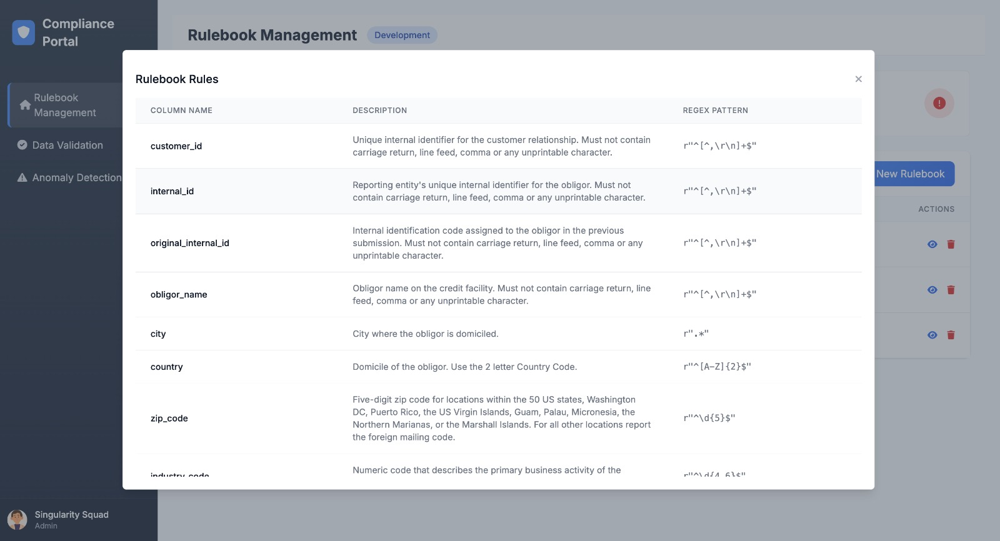

# RuleSense: Gen AI-powered Data Profiling for Regulatory Reporting

## Table of Contents

- [Introduction](#introduction)
- [Demo](#demo)
- [Inspiration](#inspiration)
- [What It Does](#what-it-does)
- [How We Built It](#how-we-built-it)
- [Challenges We Faced](#challenges-we-faced)
- [How to Run](#how-to-run)
- [Tech Stack](#tech-stack)
- [Team](#team)
- [Sample Dataset](#sample-dataset)
- [Regulatory Rules](#regulatory-rules)
- [Submission Deliverables](#submission-deliverables)

---

## Introduction

RuleSense is a Gen AI-powered compliance assistant designed to automate regulatory data profiling in the financial sector. It uses Gemini’s document processing capabilities and unsupervised machine learning models to extract rules from complex regulatory documents, validate transactional data, identify anomalies, assess risks, and recommend remediation actions.

---

## Demo

- Live Demo: [Link to Demo](#)
- Video Walkthrough: [Link to Video](#)

Screenshots:

- RuleSense 
  

- GenAI Rulebook Generator
  

- Regex Based Rulebooks
  
  
- Transactions Data Validator
  
  
- Anomaly Patterns Detector in Transactions  
  

- Anomaly Detector  
  

---

## Inspiration

Financial institutions face a major challenge when translating regulatory reporting instructions into enforceable data rules. This manual and error-prone process often slows down compliance cycles. RuleSense was built to streamline this process by automatically interpreting regulations and applying intelligent validations.

---

## What It Does

- Extracts data validation rules from regulatory PDFs using Gemini AI
- Parses extracted rules into structured JSON format with regex
- Validates uploaded transactional CSVs against these rules
- Flags validation issues and suggests remediation actions
- Detects anomalies in data using unsupervised learning
- Implements a dynamic risk scoring system
- Enables audit-friendly, explainable insights for compliance teams


---

## How We Built It

**Regulatory Rulebook Extraction**

- PDF parsing using Gemini AI’s document processing API
- Semantic chunking and cosine similarity for relevant rule matching
- Regex-based pattern extraction and rulebook generation (JSON format)

**Validation Engine**

- CSV upload interface for transactional datasets
- Field-by-field regex validation using the generated rulebook
- Detailed output: matched rule ID, violation description, suggestion

**Anomaly Detection**

- Uses Isolation Forest, DBSCAN, and LOF from scikit-learn
- Scales numeric features with StandardScaler
- Visualizes anomaly distribution using matplotlib

**Frontend**

- Built using flask templates to allow document and CSV uploads, validation display, and anomaly review


---

## Challenges We Faced

- Parsing varied PDF structures and noisy formatting
- Extracting accurate regex patterns from natural language rules
- Balancing anomaly detection thresholds to avoid false positives
- Ensuring explanations are understandable by non-technical auditors
- Maintaining performance and scalability for large CSVs

---

## How to Run

#### Clone the repository
```bash
git clone [https://github.com/your-username/rulesense.git](https://github.com/ewfx/gaidp-singularity-squad.git)
cd gaidp-singularity-squad.git
```

#### Set up environment variables
```bash
cp code/src/backend/.env.example code/src/backend/.env
```

#### Edit .env and update with your Gemini API key:
```bash
GOOGLE_API_KEY=your_api_key_here
FLASK_ENV=development
FLASK_DEBUG=1
```

### Install Docker
 - Follow official instructions to install Docker and Docker Compose:
 - macOS/Linux: https://docs.docker.com/desktop/install/mac-install/
 - Windows: https://docs.docker.com/desktop/install/windows-install/


### Verify installation:

```bash
docker --version
docker compose version
```


### Build and run the application
##### macOS/Linux
```bash
docker compose up --build
```
##### Windows

```bash
docker-compose up --build
```

### Open the application
##### Once the container is running, go to:
```bash
http://localhost:5001
```
