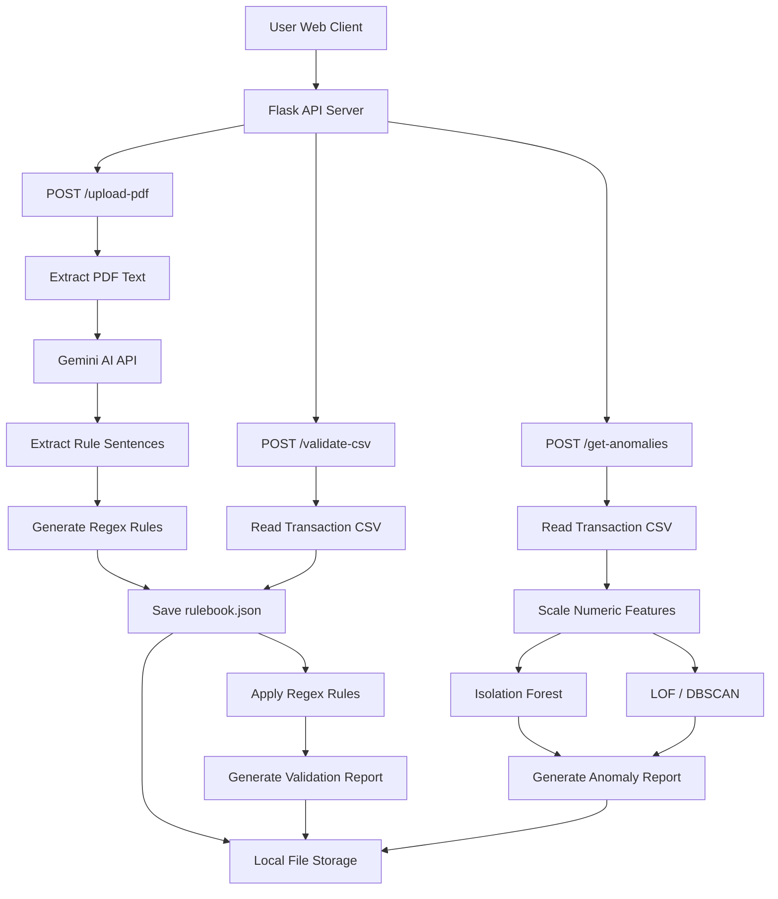

## 🏗️ Architecture

RuleSense is built as a modular, scalable backend system that enables regulatory data profiling through PDF-based rule extraction, CSV validation, and anomaly detection using machine learning. It is designed with microservice-like components orchestrated through a Flask backend, using local file storage and loosely coupled Python modules.

---

### 🎯 High-Level Workflow

1. **PDF Upload**  
   A regulatory rulebook (e.g., FR Y-14Q) is uploaded via the Flask UI.
   
2. **Rule Extraction**  
   The PDF is parsed using PyMuPDF, sent to Gemini AI to extract semantically relevant rule instructions, and then converted into structured regex rules.

3. **CSV Validation**  
   A transaction file is uploaded and validated field-by-field against the generated rules in `rulebook.json`.

4. **Anomaly Detection**  
   The user can initiate anomaly detection, where Isolation Forest and LOF/DBSCAN identify outliers based on transaction behavior.

5. **Reports**  
   All outputs — rulebooks, validation errors, and anomaly logs — are saved to disk and presented to the user.

---

### 🧱 Core Components

| Component            | Description                                                                 |
|----------------------|-----------------------------------------------------------------------------|
| **Flask API**         | Acts as the backend service to handle uploads, routing, and ML execution.  |
| **PDF Parser**        | Uses PyMuPDF to extract text from uploaded regulatory documents.           |
| **Gemini AI**         | Processes chunks of regulatory text to extract meaningful rule definitions. |
| **Regex Generator**   | Converts plain text instructions into structured regex validation rules.    |
| **Rulebook**          | Stored as a local JSON file (`rulebook.json`) used for CSV validation.      |
| **CSV Validator**     | Applies regex to every field/row and reports validation errors.             |
| **Anomaly Detector**  | Uses `IsolationForest` and `LOF/DBSCAN` for outlier detection in data.      |
| **File Storage**      | Stores uploaded PDFs, CSVs, logs, rulebooks, and generated reports.         |

---

## Architecture Diagram (High-Level)

