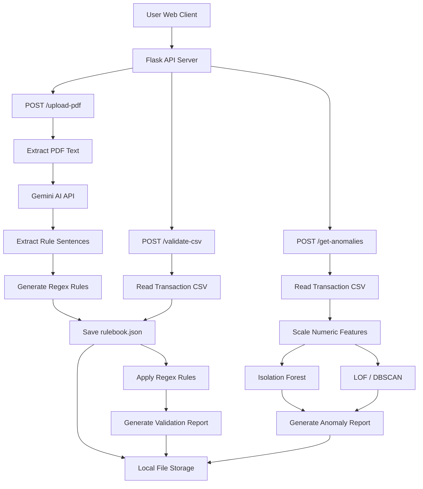

# RuleSense – Architectural Design Document

## Overview

**RuleSense** is a Generative AI–powered data profiling platform tailored for regulatory compliance in the financial domain. It automates the process of extracting validation rules from regulatory documents and applies these rules to transactional data for validation and anomaly detection.

The platform supports the complete pipeline:
1. Uploading a regulatory PDF to extract semantic rules.
2. Creating a structured rulebook in JSON.
3. Validating uploaded transactional CSVs against these rules.
4. Detecting anomalies using unsupervised ML techniques.
5. Presenting results through a Flask-based web interface.

---

## Architecture Diagram (High-Level)

