# 🕵️‍♂️ Unsupervised Anomaly Detection on Corporate Loan Transactions

This project identifies anomalous corporate loan transactions using **unsupervised machine learning**, specifically **Isolation Forest**. The focus is on detecting outliers that may represent fraud, data entry errors, or unusual financial patterns.

---

## 📊 Dataset

- **File**: `CorpLoanTransaction.csv`
- **Type**: Corporate loan transaction records
- **Features**: Numeric fields selected automatically
- **Missing Values**: Rows with nulls in selected features are dropped

---

## 🔄 Workflow

```mermaid
sequenceDiagram
    actor User as 👤 User
    participant Loader as 📂 Data Loader
    participant Preprocessor as 🔧 Preprocessor
    participant Model as 🧠 IsolationForest Model
    participant Analyzer as 📊 Analyzer
    participant Visualizer as 📈 Visualizer

    User->>Loader: Load "CorpLoanTransaction.csv"
    Loader->>Preprocessor: Select numeric columns
    Preprocessor->>Preprocessor: Drop rows with missing values
    Preprocessor->>Preprocessor: Scale features using StandardScaler

    Preprocessor->>Model: Train IsolationForest (contamination=0.15)
    Model-->>Analyzer: Predict labels (0 = normal, 1 = anomaly)
    Analyzer->>Analyzer: Calculate anomaly percentage
    Analyzer->>User: Print anomaly summary

    Model->>Visualizer: Get decision_function scores
    Visualizer->>User: Plot histogram of scores
```

